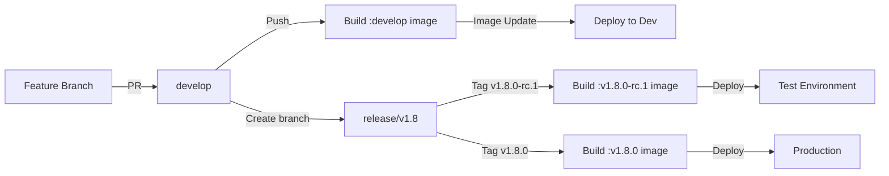
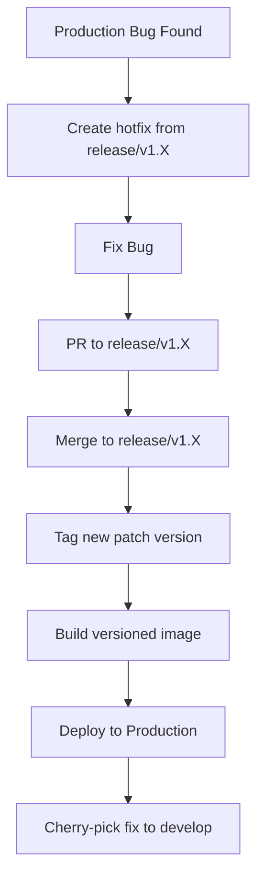

# Contributing to This Project

Welcome! This document describes our Git workflow and deployment process. Please read it carefully before contributing.

## Table of Contents
- [Overview](#overview)
- [Environments](#environments)
- [Branch Strategy](#branch-strategy)
- [Development Workflow](#development-workflow)
- [Release Process](#release-process)
- [Release Stabilization (RC Process)](#release-stabilization-rc-process)
- [Hotfix Process](#hotfix-process)
- [Backporting](#backporting)
- [Security Patches Across Multiple Releases](#security-patches-across-multiple-releases)
- [Backflow: Release to Develop](#backflow-release-to-develop)
- [Support / Maintenance Policy](#support--maintenance-policy)
- [Docker Images](#docker-images)
- [FAQ](#faq)

## Overview

We use a Git Flow-inspired workflow with **persistent release branches**. Every minor version gets a `release/v1.X` branch. Tags always live on release branches. Deployment systems watch for new image tags and deploy them automatically.



```
feature/* ──► develop ──► release/v1.8 ──► v1.8.0, v1.8.1, ...
                     ──► release/v1.9 ──► v1.9.0, ...

Backflow (patches):
  release/v1.X (hotfix) ──cherry-pick──► develop
```

## Environments

| Environment | Purpose | Branch/Tag | Image Tag | Deployment Method |
|------------|---------|------------|-----------|-------------------|
| **Development** | Latest features, may be unstable | `develop` | `:develop` | Auto (on image update) |
| **Test** | Pre-production testing via RC tags | `v*-rc.*` tags on `release/v1.X` | `:v1.8.0-rc.1` | Manual deploy |
| **Production** | Live system | `v*` tags on `release/v1.X` | `:v1.8.0` | Manual deploy |

## Branch Strategy

### Long-lived Branches

#### `develop`
- Integration branch for new features
- Always deployable to dev environment
- Protected: requires PR with approval

#### `release/v1.X`
- Created from `develop` when ready to release or stabilize a minor version
- Persistent home for all patches to that minor version
- All version tags (`v1.X.Y`) live here
- Test via RC tags (`:v1.8.0-rc.1`) before creating the final release
- **Never merged back** — fixes flow to `develop` via cherry-pick only

### Supporting Branches

#### `feature/*`
- Created from: `develop`
- Merged into: `develop`
- Naming: `feature/descriptive-name`
- Example: `feature/add-user-authentication`

#### `hotfix/*`
- Created from: the target `release/v1.X` branch
- Merged into: the target `release/v1.X` branch (then cherry-picked to `develop`)
- Naming: `hotfix/issue-description`
- Example: `hotfix/fix-payment-processing`

## Development Workflow

### Step-by-Step Guide

#### 1. Start a New Feature

```bash
# Always start from latest develop
git checkout develop
git pull origin develop

# Create your feature branch
git checkout -b feature/your-feature-name

# Make your changes
git add .
git commit -m "feat: add new feature"

# Push to GitHub
git push origin feature/your-feature-name
```

#### 2. Create Pull Request

1. Go to GitHub and create a PR from your feature branch to `develop`
2. Fill in the PR template
3. Request review from team members
4. Address any feedback

#### 3. After PR Approval

Once merged to develop:
- GitHub Actions automatically builds Docker images tagged `:develop`
- Images are automatically deployed to internal dev environment

## Release Process

### Creating a Production Release

Every release goes through at least one RC tag for testing. See [Release Stabilization (RC Process)](#release-stabilization-rc-process) for the full flow.

Once the RC is stable, create the final release via GitHub UI:

1. Go to **Releases** → **Draft a new release**
2. Click **Choose a tag** → type `v1.8.0` → select **Create new tag**
3. Set **Target** to `release/v1.8`
4. Set **Release title** to `v1.8.0`
5. Write release notes (features, bug fixes, breaking changes)
6. Leave **Set as pre-release** unchecked
7. Click **Publish release**

GitHub Actions will automatically build production images:
- `ghcr.io/eneo-ai/eneo-backend:v1.8.0`
- `ghcr.io/eneo-ai/eneo-frontend:v1.8.0`

Deploy to production by updating your deployment config to point at the new version tag.

### Semantic Versioning

We use semantic versioning: `MAJOR.MINOR.PATCH`

- **MAJOR** (1.0.0 → 2.0.0): Breaking changes
- **MINOR** (1.0.0 → 1.1.0): New features (backwards compatible)
- **PATCH** (1.0.0 → 1.0.1): Bug fixes

## Release Stabilization (RC Process)

RC tags also live on the release branch. Create the release branch from `develop` when you're ready to **start** stabilizing:

```
develop ──► create release/v1.8
                 │
                 ├──► v1.8.0-rc.1 (tag, pre-release) → deploy to test env
                 ├──► fix directly on branch or via PR
                 ├──► v1.8.0-rc.2 (tag, pre-release)
                 └──► v1.8.0 (final release)
```

**1. Create release branch from `develop`:**

```bash
git checkout develop && git pull
git checkout -b release/v1.8
git push origin release/v1.8
```

**2. Create the first RC via GitHub UI:**

1. Go to **Releases** → **Draft a new release**
2. Click **Choose a tag** → type `v1.8.0-rc.1` → select **Create new tag**
3. Set **Target** to `release/v1.8`
4. Set **Release title** to `v1.8.0-rc.1`
5. Check **Set as pre-release**
6. Click **Publish release**

**3. Fix issues** directly on the release branch (or via `hotfix/*` PRs to `release/v1.8`)

**4. Create subsequent RCs** the same way via GitHub Releases (tag `v1.8.0-rc.2`, target `release/v1.8`, mark as pre-release)

**5. When stable, create the final release** via GitHub Releases:
- Tag `v1.8.0`, target `release/v1.8`
- Leave **Set as pre-release** unchecked
- Add full release notes

During stabilization, `develop` can continue receiving new features for the next release.

## Hotfix Process

One consistent flow for all hotfixes, regardless of which version is affected:



### Hotfix Example

**1. Create hotfix from the affected release branch:**

```bash
git checkout release/v1.7
git pull origin release/v1.7
git checkout -b hotfix/fix-critical-bug

# Make your fix
git add .
git commit -m "fix: resolve critical payment processing error"

# Push and create PR to the release branch
git push origin hotfix/fix-critical-bug
# Create PR on GitHub: hotfix/fix-critical-bug → release/v1.7
```

**2. After PR merge, create the patch release via GitHub UI:**

1. Go to **Releases** → **Draft a new release**
2. Click **Choose a tag** → type `v1.7.4` → select **Create new tag**
3. Set **Target** to `release/v1.7`
4. Set **Release title** to `v1.7.4`
5. Describe the fix in the release notes
6. Click **Publish release**

GitHub Actions builds `v1.7.4` images. The `:latest` tag is NOT overwritten if `v1.8.0` already exists.

**3. Deploy** `v1.7.4` to the affected production instance.

**4. Cherry-pick the fix to develop:**

Use the **squashed commit on the release branch** as the cherry-pick source, not the original commit from your `hotfix/*` branch. Because PRs are squash-merged, the commit on `release/v1.7` is the authoritative one; the hotfix branch's pre-squash SHA won't exist after the branch is deleted.

```bash
# Grab the SHA from the release branch (the squashed merge commit)
git checkout release/v1.7 && git pull
git log -1 --format=%H  # copy this SHA

git checkout develop && git pull origin develop
git cherry-pick <sha-from-release-branch>
git push origin develop
```

## Backporting

When a bug is fixed on `develop` but also affects an older release:

**1. Cherry-pick the fix to the release branch:**

```bash
git log --oneline develop  # identify the fix commit
git checkout release/v1.7
git pull origin release/v1.7
git cherry-pick <commit-hash>
git push origin release/v1.7

# If conflicts, resolve them and create a PR instead:
git checkout -b fix/backport-xyz
git push origin fix/backport-xyz
# Create PR: fix/backport-xyz → release/v1.7
```

**2. After the fix lands on the release branch, tag via GitHub UI:**

1. Go to **Releases** → **Draft a new release**
2. Tag: `v1.7.5`, Target: `release/v1.7`
3. Describe the backported fix
4. Click **Publish release**

## Security Patches Across Multiple Releases

When a security fix must go to multiple supported releases:

1. **Fix on the oldest affected release branch first**
2. **Cherry-pick forward** to each newer release branch
3. **Cherry-pick to `develop`**
4. **Tag new patch versions** on each affected release branch

Order matters: **oldest → newest → develop**. This minimizes merge conflicts since newer branches are closer to develop.

**Example: security fix needed on v1.6, v1.7, and v1.8:**

At each step, the `<commit-hash>` is the SHA of the **squashed merge commit on the branch you just merged into** — re-read it from that branch before cherry-picking forward.

```bash
# 1. Fix on oldest affected branch
git checkout release/v1.6
git checkout -b hotfix/security-fix
# ... fix ...
git push origin hotfix/security-fix
# PR → release/v1.6, merge (squash)

# Grab the squashed SHA from release/v1.6
git checkout release/v1.6 && git pull
SHA=$(git log -1 --format=%H)

# 2. Cherry-pick forward (re-read SHA from each branch after it lands)
git checkout release/v1.7 && git pull
git cherry-pick "$SHA"
git push origin release/v1.7
SHA=$(git log -1 --format=%H)  # new SHA on release/v1.7

git checkout release/v1.8 && git pull
git cherry-pick "$SHA"
git push origin release/v1.8
SHA=$(git log -1 --format=%H)  # new SHA on release/v1.8

# 3. Cherry-pick to develop
git checkout develop && git pull
git cherry-pick "$SHA"
git push origin develop
```

**Then create releases for each branch via GitHub UI:**

| Tag | Target | Pre-release? |
|-----|--------|-------------|
| `v1.6.3` | `release/v1.6` | No |
| `v1.7.5` | `release/v1.7` | No |
| `v1.8.1` | `release/v1.8` | No |

For each: **Releases** → **Draft a new release** → set tag, target, and release notes → **Publish release**.

## Backflow: Release to Develop

**Every fix that lands on a release branch must also be cherry-picked to `develop`.** If you skip this, the fix will be missing in the next release.

After merging a hotfix PR to a release branch:

1. **Immediately cherry-pick** the fix commit to `develop`
2. **Use the squashed commit on the release branch as the source** — not the original commit from your `hotfix/*` branch (which won't survive the branch deletion)
3. If cherry-pick conflicts, create a PR to `develop` with the manual resolution

```bash
# Get the SHA from the release branch
git checkout release/v1.7 && git pull
git log -1 --format=%H  # this is the SHA to cherry-pick

git checkout develop && git pull
git cherry-pick <sha-from-release-branch>
git push origin develop
```

This applies to all fixes on release branches — hotfixes, RC stabilization fixes, backported patches, and security fixes.

## Support / Maintenance Policy

- **Supported:** current release + 1 previous minor version (receives bug fixes and security patches)
- **EOL:** older release branches can be deleted after confirming no customers depend on them
- Review and update this policy as the team/customer base grows

## Docker Images

### Image Tagging Strategy

| Source | Docker Tags | Purpose |
|--------|------------|---------|
| `develop` branch | `:develop`, `:develop-{sha}` | Development testing |
| `v*-rc/beta` tags | `:v1.8.0-rc.1` (no `:latest`) | Test environment / pre-release testing |
| `v*` tags (stable) | `:v1.8.0`, `:latest` (if highest version) | Production releases |

**How `:latest` is decided:** Evaluated at tag-push time by comparing the new tag against all existing stable tags (`v*` excluding pre-releases like `-rc`, `-beta`) via semver sort. Only the highest stable version wins `:latest`.

Consequences to be aware of:
- Patching an older release (e.g. tagging `v1.7.4` while `v1.8.0` exists) will NOT overwrite `:latest` — the older patch correctly stays out of `:latest`.
- If an out-of-order release happens (e.g. `v1.8.0` was tagged first, then later `v1.7.5` on the old branch), `:latest` still points to `v1.8.0` — the comparison is "highest at push time," not "most recently pushed."
- RC / pre-release tags never receive `:latest`, regardless of version number.
- If you ever need to move `:latest` to a different version (e.g. after yanking a bad release), you must retag manually in the registry — CI will not do it retroactively.

### Image Locations

```bash
# Backend Images
ghcr.io/eneo-ai/eneo-backend:develop      # Latest from develop
ghcr.io/eneo-ai/eneo-backend:v1.8.0-rc.1  # RC for testing
ghcr.io/eneo-ai/eneo-backend:v1.8.0       # Specific release
ghcr.io/eneo-ai/eneo-backend:latest       # Highest stable release

# Frontend Images
ghcr.io/eneo-ai/eneo-frontend:develop      # Latest from develop
ghcr.io/eneo-ai/eneo-frontend:v1.8.0-rc.1  # RC for testing
ghcr.io/eneo-ai/eneo-frontend:v1.8.0       # Specific release
ghcr.io/eneo-ai/eneo-frontend:latest       # Highest stable release
```

## FAQ

### Q: When should I create a feature branch?
**A:** For any change that adds functionality, fixes a bug, or modifies behavior. Even small changes should go through a PR for code review.

### Q: Can I push directly to develop or release branches?
**A:** No. All long-lived branches are protected and require pull requests with approvals.

### Q: Where and how do I create version tags?
**A:** Always on a `release/v1.X` branch. Use **GitHub Releases** (not the CLI) to create tags — this gives you release notes, pre-release marking, and a clean audit trail. See [Quick Command Reference](#creating-tags-github-ui).

### Q: How do I know what version to tag?
**A:** Check the latest tag on the repo's **Releases** page or with `git tag --list 'v*' --sort=-v:refname | head -1`. Then:
- Breaking changes → increment MAJOR
- New features → increment MINOR
- Bug fixes → increment PATCH

### Q: What if I need to patch an old version?
**A:** Use the same hotfix flow — create a `hotfix/*` branch from the relevant `release/v1.X`, PR to the release branch, merge, tag. No special handling needed.

### Q: What if I need to test something quickly?
**A:** Create a feature branch and PR to develop. Once merged, it auto-deploys to dev environment.

### Q: Can I delete old feature branches?
**A:** Yes! Delete them after merging to keep the repo clean:
```bash
git push origin --delete feature/old-feature
git branch -d feature/old-feature
```

### Q: Can I delete old release branches?
**A:** Only if the version is EOL (see [Support / Maintenance Policy](#support--maintenance-policy)). Confirm no customers depend on that version first.

### Q: How do I rollback production?
**A:** Deploy the previous version tag:
```bash
# Check available versions
git tag --list 'v*' --sort=-v:refname

# Deploy previous version (e.g., v1.7.3 if v1.8.0 has issues)
# Use your deployment tool with v1.7.3 images
```

## Quick Command Reference

### Git commands

```bash
# Start new feature
git checkout develop && git pull
git checkout -b feature/my-feature

# Update feature branch with latest develop
git checkout feature/my-feature
git merge develop

# Create release branch
git checkout develop && git pull
git checkout -b release/v1.8
git push origin release/v1.8

# Hotfix any version
git checkout release/v1.7 && git pull
git checkout -b hotfix/critical-fix
# ... fix, push, PR to release/v1.7, merge ...
# Then tag via GitHub UI (see below)
# Cherry-pick to develop
```

### Creating tags (GitHub UI)

Always create tags through **GitHub Releases** rather than the CLI. This gives you release notes, pre-release marking, and a consistent audit trail.

| Action | Tag | Target branch | Pre-release? |
|--------|-----|--------------|-------------|
| New release | `v1.8.0` | `release/v1.8` | No |
| Release candidate | `v1.8.0-rc.1` | `release/v1.8` | Yes |
| Hotfix patch | `v1.7.4` | `release/v1.7` | No |

**Steps:** Repo → **Releases** → **Draft a new release** → type new tag → select target branch → write notes → set pre-release if RC → **Publish release**

---
