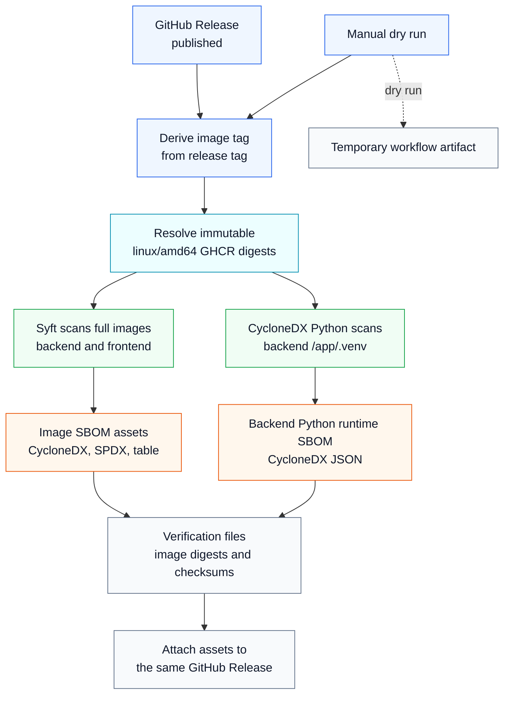

# Release SBOMs

Each Eneo release includes Software Bill of Materials (SBOM) files for the
published backend and frontend container images. The files are attached to the
GitHub Release so you can download the dependency inventory for the exact
version you run.

The release workflow covers:

- `ghcr.io/eneo-ai/eneo-backend:<version>`
- `ghcr.io/eneo-ai/eneo-frontend:<version>`

For a release tag such as `v2.0.0`, the image tag is `2.0.0`.
The SBOM filenames use the release tag, including the `v` prefix. Prereleases
use the same process, so a tag such as `v2.0.0-rc.2` gets SBOM files for that
prerelease.

## How the release flow works

When maintainers publish a GitHub Release, the release SBOM workflow runs
automatically:

1. The workflow reads the release tag and derives the container image tag.
2. It waits for the matching backend and frontend images in GitHub Container
   Registry.
3. It resolves the immutable `linux/amd64` image digest for each image.
4. It scans those digest references, not only the mutable image tags.
5. It uploads the generated files to the same GitHub Release page.

Each release keeps its own SBOM files. Older release pages keep their original
assets, so you can compare one version with the next.

The same workflow can also run manually as a dry run. In dry-run mode it creates
the files as a temporary workflow artifact and does not attach them to the
GitHub Release.

The diagram follows the same path as the release workflow:

## Why Eneo uses more than one SBOM file

Eneo publishes a small set of files because each file answers a different
question.

The backend and frontend image SBOMs are the main release inventory. They are
generated with [Syft](https://github.com/anchore/syft), which scans container
images and filesystems and can export several SBOM formats. For Eneo, Syft
scans the released backend and frontend image digests and creates:

- [CycloneDX](https://cyclonedx.org/) JSON for tools that consume the
  CycloneDX SBOM standard.
- [SPDX](https://spdx.dev/learn/overview/) JSON for tools and processes that
  use SPDX.
- A readable package table for quick human review.

The backend also has a narrower Python runtime SBOM. It is generated with the
[CycloneDX Python tool](https://github.com/CycloneDX/cyclonedx-python) from the
Python environment installed at `/app/.venv` inside the released backend image.
This file is useful when you specifically want the backend Python dependency
inventory. It does not replace the full backend image SBOM because it does not
describe the whole container image.

Eneo scans the released image digests instead of source lockfiles because the
image digest is the shipped artifact. Lockfiles describe build input; the image
describes what users receive.

## Files on the release page

Each release publishes these files:

| File | Purpose |
| --- | --- |
| `eneo-backend-<release-tag>-linux-amd64.cyclonedx.json` | Backend image SBOM in CycloneDX JSON |
| `eneo-backend-<release-tag>-linux-amd64.spdx.json` | Backend image SBOM in SPDX JSON |
| `eneo-backend-<release-tag>-linux-amd64.table.txt` | Backend image package list for human review |
| `eneo-backend-python-runtime-<release-tag>-linux-amd64.cyclonedx.json` | Backend Python runtime SBOM in CycloneDX JSON |
| `eneo-frontend-<release-tag>-linux-amd64.cyclonedx.json` | Frontend image SBOM in CycloneDX JSON |
| `eneo-frontend-<release-tag>-linux-amd64.spdx.json` | Frontend image SBOM in SPDX JSON |
| `eneo-frontend-<release-tag>-linux-amd64.table.txt` | Frontend image package list for human review |
| `IMAGE-DIGESTS.txt` | Exact image tags and digests that were scanned |
| `SBOM-SHA256SUMS.txt` | SHA-256 checksums for the SBOM bundle |

Use the `.table.txt` files when you want to inspect a package list quickly. Use
CycloneDX or SPDX when you need to import an SBOM into another tool.

## What the SBOM covers

The image SBOMs describe packages Syft finds inside the released container
images.

For the backend image, this usually includes:

- operating system packages
- Python packages installed in the image
- binaries and other package metadata Syft can identify

For the frontend image, this usually includes:

- operating system packages
- npm packages present in the image
- binaries and other package metadata Syft can identify

The backend Python runtime SBOM is narrower. It is generated from the Python
environment installed at `/app/.venv` inside the released backend image. It is
validated during the workflow by checking that the Python distributions found
in that runtime environment appear in the generated CycloneDX file.

The SBOMs are generated from immutable image digest references, not only from
tags. `IMAGE-DIGESTS.txt` records the digest references used during the scan.

## Which file should you use?

Use the backend or frontend CycloneDX JSON files when your tooling expects
CycloneDX and you want the full container image inventory.

Use the SPDX JSON files when your process or supplier tooling expects SPDX.

Use `eneo-backend-python-runtime-<release-tag>-linux-amd64.cyclonedx.json` when
you want a focused view of the Python packages installed in the backend runtime
environment.

Use the `.table.txt` files when you want to read the package list without
importing an SBOM into another tool.

Use `IMAGE-DIGESTS.txt` to see which GHCR image digests were scanned. Use
`SBOM-SHA256SUMS.txt` to check the downloaded SBOM files against the checksums
published with the release.

## What the SBOM does not cover

An SBOM is an inventory. It does not decide whether a package is vulnerable or
whether a vulnerability is reachable in Eneo.

Use vulnerability scanners such as Grype, Trivy, GitHub Advanced Security, or
your internal tooling if you need vulnerability findings based on the SBOM.

The current release assets are not signed. Their authenticity relies on
GitHub-managed release asset storage and the image digests recorded in
`IMAGE-DIGESTS.txt`.

The current release workflow publishes `linux/amd64` SBOM files. If Eneo adds
more release platforms later, each platform should get its own SBOM files
because package contents can differ by image architecture.

## Standards and tools

These references explain the formats and tools used by Eneo:

- [CycloneDX](https://cyclonedx.org/) is the SBOM format used for the
  CycloneDX JSON release assets.
- [OWASP SCVS SBOM requirements](https://scvs.owasp.org/scvs/v2-software-bill-of-materials/)
  describe maturity expectations such as automated SBOM creation,
  machine-readable formats, metadata, and component inventory.
- [Syft](https://github.com/anchore/syft) is used for the backend and frontend
  image SBOMs.
- [CycloneDX Python](https://github.com/CycloneDX/cyclonedx-python) is used for
  the backend Python runtime SBOM.
- [Anchore SBOM Action](https://github.com/anchore/sbom-action) provides the
  GitHub Action helpers used to download Syft in the release workflow.
- [SPDX](https://spdx.dev/learn/overview/) is the other machine-readable SBOM
  format published for each image.

## Check a release

1. Open the [Eneo GitHub Releases page](https://github.com/eneo-ai/eneo/releases)
   and choose the version you use.
2. Download the backend and frontend `.table.txt` files for a quick review.
3. Download CycloneDX or SPDX image SBOMs for your security tooling.
4. Download the backend Python runtime SBOM if you only need the Python
   dependency inventory for the backend runtime environment.
5. Check `IMAGE-DIGESTS.txt` if you need the exact image digests scanned.
6. Check `SBOM-SHA256SUMS.txt` if you need file checksums for the SBOM bundle.

To compare two releases, compare the SBOM files from both release pages. Package
additions, removals, and version changes show what changed between the images.
